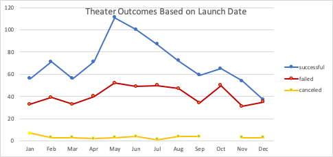
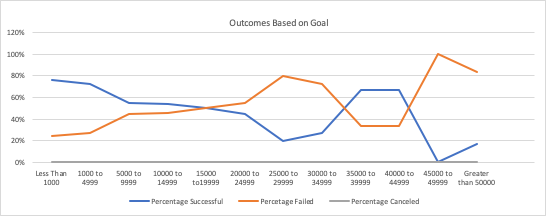

# Kickstarting with Excel

## Overview of Project
This project consists of an analysis performed on the Kickstarter data set by using pivot tables and charts to visualize campaign outcomes based on their launch dates and their funding goals. 

### Purpose
The main purpose of this analysis is to determine whether or not the launching of certain projects is feasible based on goal amount and time of year. The trends uncovered in this analysis give us an idea of the best time of the year to launch a campaign given a specific goal amount. 

## Analysis and Challenges
For the analysis of this data set, a pivot table was created along with a line chart to represent the Theater outcomes based on launch date. 

Additionally, a table was created to represent the percentage of successful, failed, and canceled plays based on the funding goal amount.

There were a couple of difficulties when performing this analysis such as dealing with a very large data set, for which we applied filters and formulas in order to facilitate the process of data wrangling. Additionally, some of the data was not easy to read. For example, the "Deadline" and "Launched_at" columns contained Unix timestamps, which needed to be converted into a day-month-year format that we could interpret.

### Analysis of Outcomes Based on Launch Date
1. This analysis uncovered that the rate of success for Theater Kickstarters follows a trend, which is very high rate of success during May and June specifically which makes them the best months to launch a campaign.
2. December on the other hand is the worst time to launch a campaign with the highest percentage of failed Kickstarters.

### Analysis of Outcomes Based on Goal
From the outcomes based on the goal amount we can infer that those projects ranging from less than \$1000 and between \$1000 and  \$4999, achieved 76% and 73% of success, respectively. Furthermore, we can state that Goal amount and rate of success are inversely proportional and therefore it is advised to keep the Goal below $4999.

### Challenges and Difficulties Encountered

## Results

#### What are two conclusions you can draw about the outcomes based on launch date?
1. The best time to launch a Theater campaign is between May and June or even July but definitely not toward the end of the year.
2. Starting in January the number of successful campaign trends upwards (with the exception of March) until it reaches a peak in May and from there the overall trend is downwards.

#### What can you conclude about the Outcomes based on Goals?
We can conclude that the goal ranges with the highest probability of success are (1) less than \$1000 and (2) between \$1000 and \$4999. Kickstarters with goals in these ranges represent 51% of total successful Kickstarters. We can observe in the line graph that the success line follows a downwards direction as the goal increases in almost all cases (however, as we increase the goal amount, the number of observations decreases as well so we have larger error bars and more uncertainty about this confusion).

#### What are some limitations of this dataset?
1. The most recent data in the Kickstarter data set is dated to 2017 which could be a little outdated when forecasting for 2020 and on. 
2. The are a couple of extreme values which might not be representative of the Analysis we are trying to carry and that affect the measures of distributions greatly. 
3. Some of the data is in a format that is not easy to read. For example, the columns "I" and "J" which are timestamps values which needed to be converted into regular Date format in order to perform further analysis.

#### What are some other possible tables and/or graphs that we could create?
We could create another chart to determine the correlation between the length of a campaign and its success. For example, `Outcomes based on campaign length`. Additionally, we could create a pivot chart to pin point if there is a specific subcategory within Theater that gets funded the most and most importantly what does not get enough funding and therefore we need to stay away from. 

